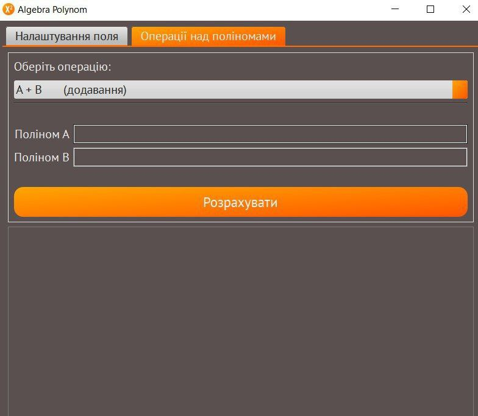
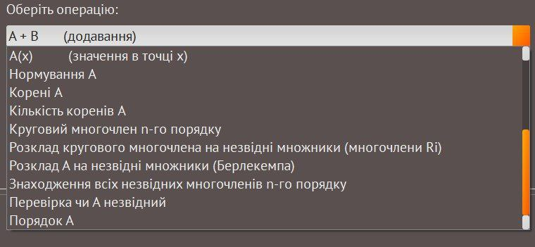
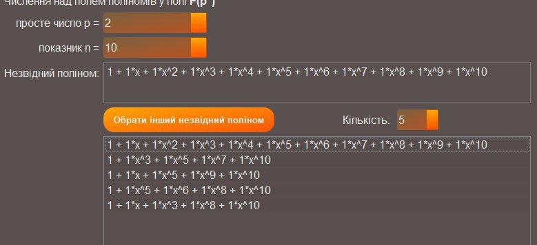

# Algebra Polynom
### Tool for working with polynomials over a finite field (provided polynomial Galois field support, i.e. working with polynomials in a finite field defined by an irreducible polynomial).

## Documentation: [click here](https://htmlpreview.github.io/?https://github.com/WAG13/FF-Polynomials-App/blob/master/documentation/html/index.html)

## Screenshots:

# Числення над полем поліномів у полі F\_(q)
На вхід задається просте число q (можливо, довге) і показник n.

1. Додавання, віднімання, множення двох многочленів.
   @Darrisha

2. Знаходження похідної многочлена. Нормування многочлена. Знаходження значення многочлена у точці.
   @darikivaa

3. Знаходження коренів многочлена.
   @karina_masol
   @yuriy_momotenko

4. Знаходження кількості коренів многочлена
   @yana_s10

5. Знаходження оберненого многочлена
   @yaroslava_levchuk
   @mNataliia

6. Знаходження частки та остачі від ділення одного многочлена на інший
   @Anton_Hl

7. Знаходження НСД двох многочленів
   @Public_name

8. Знаходження кругового многочлена заданого порядку
   @RostyslavMV

9. Розклад кругового многочлена на незвідні множники використовуючи многочлени Ri
   @gardenapple

10. Розклад довільного многочлена на незвідні множники за допомогою алгоритму Берлекемпа
    @jlare
    @ozzwoy

11. Знаходження всіх незвідних многочленів заданого порядку
    @vlad_prokopchuk

12. Перевірка чи є многочлен незвідним
    @totskys

13. Знаходження порядку незвідного многочлена
    @kurdelchuk
    @marin_ap

14. Знаходження порядку довільного многочлена
    @vetalmon20
